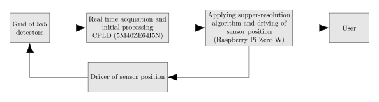
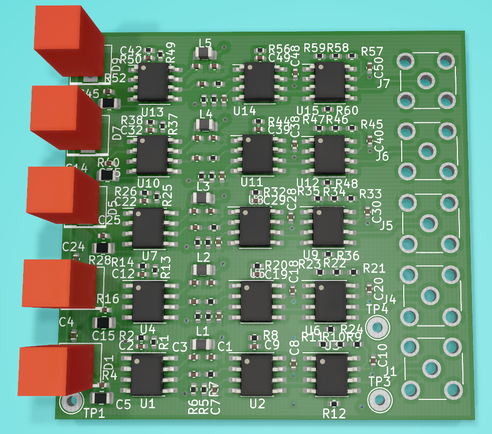

# Discrete Pixel Detector For Radiation Analysis

**This project is unfinished.**

## Principle of operation

A regular radioactivity detector (e.g. Geiger counter) has only one detecting element so it gives only one measured value. It's similar to measure the level of light using photoresistor or measure temperature using thermistor. Imagine that multiple of detectors are arranged in a grid, now it's possible to measure/imaging sample's radioactivity in 2D space. This is the same as measure/imaging light using a camera or temperature using a thermal camera. In short, it will provide image with visualization of the object in the function of its radioactivity.

There are however two problems. First is that to image an object at a distance, a lens needs to be used to focus the image on the detector. AFAIK there is no such thing for radioactive particles (other than X rays), and even if it is, it's probably far beyond my capabilities. This gives the limitation that the samples need to be very close to the sensor. This is not a big limitation because the used detector is not very effective, samples must be close to it anyway.

The second problem is that to have good resolution, a lot of sensors needs to be used and they need to be packed tightly next to each other. This is problematic because each sensor costs money and with a lot of sensors, price of the device goes up.

To limit the problem with the amount of sensors, I think it will be possible to use [super-resolution algorithm, that I implemented years ago (I'm not an author of the algorithm)](https://github.com/RobertGawron/supper-resolution). It's done in Python and requires a lot of computations, so it will be running on Raspberry. The disadvantage of this solution is that with each image taken, the sensor needs to be moved by a small x-y offset. The movement will be done by using two step motors and a bit of mechanical parts. This also adds costs and complexity.

The [detector used here is based on a photodiode, it was already build and tested](https://github.com/RobertGawron/SemiconductorRadioactivityDetector).

## System architecture

In order to obtain acquisition of sensor data in real time, a CPLD was used. This is probably overkill and a microcontroller would be ok, but I wanted to explore the world of CPLD/FPGA.

## Hardware

There are two PCB designs - first for the detector, second for the main module. All of them will/are being designed using KiCad6 and send to China for manufacturing.

First stage amplifier i crucial since the currents are very low, it must must use advanced/expensive opamp, because there are 5x5=25 detector, this increases a lot the price of the hardware.

[Click for details.](./Hardware/README.md)

Below is a render of a sensor PCB (the red boxes will be photodiodes in real device).

## Software

Software will be done in Verilog (acquisition of the data) and Python (data processing and improvement of image resolution).

[Click for details](./Software/README.md)

## Mechanic

Mechanical parts are needed to provide movement of the sensor. It is also possible to resign from super-resolution algorithm and don't do the mechanic, but that would decrease the quality of measurements.

Most of the parts will be 3D-printed, the rest will be bough in China to save costs. Parts cost approximately 50 euro.

[Click for details](./Mechanic/README.md)