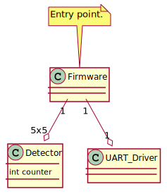

# Tools

* **Quartus Prime Lite Edition** is used for development.
* **ModelSim-Altera** is used for simulation.

# Architecture

I don't know Veriog so I don't know if I'm going in a good direction, anyway here is class diagram  of current implementation. I know that class diagrams might not suit perfectly to HDL languages, but since UML is kind of abstract language it will do the job. Yep, the current implementation is on very early stage.

